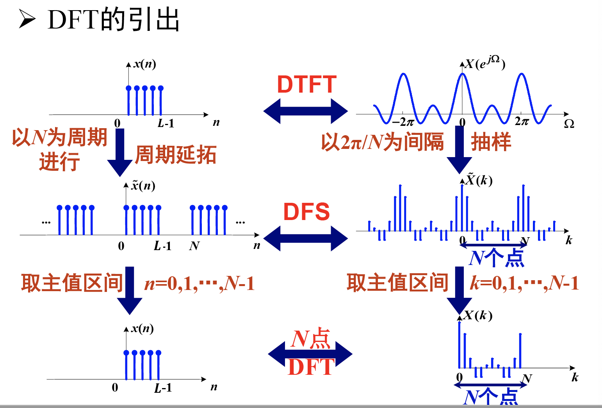

# Lecture 9

## 离散傅立叶级数

\[ \begin{align}
X(k) &= \sum_{n=0}^{N-1}x(n)e^{-j\frac{2\pi}{N}nk}, &k\in\mathbb{Z} \\
x(n) &= \frac{1}{N}\sum_{k=0}^{N-1}X(k)e^{j\frac{2\pi}{N}nk}, &n\in\mathbb{Z}
\end{align} \]

## 离散傅立叶变换

计算机能够处理的信号应当满足：

1. 离散的
2. 有限的

前面章节我们所说的各类变换与级数中要么时域为连续函数，要么频域为连续函数。而离散傅立叶级数虽然都是离散信号，但仍是无限序列，因此我们需要引入离散傅立叶变换来得到时域和频域都为离散且有限的信号。

我们发现，有限长序列，或加窗后的序列的DTFT是周期连续函数。那么我们对其中一个周期进行采样或离散化，那么我们就得到了近似包含频域全部信息的离散且有限的序列。

同时我们也发现，离散傅立叶级数DFS的时域与频域都为离散的，那么只要取其中有限个点即可满足条件。

我们做以下定义：

- **DFT是一个周期\((0,1,\cdots,N-1)\)上的DFS**
- **DFT是对DTFT进行间隔为\(\frac{2\pi}{N}\)的采样后取其中一个周期的序列**
- DFT的点数\(N\)需要不小于序列长度，才能让采样后的序列表示原来连续谱的信息。后面有时会用点数\(N\)同时表示序列长度和采样点数。

定义式：

\[ \begin{align}
X(k) &= \sum_{n=0}^{N-1}x(n)e^{-j\frac{2\pi}{N}nk}, &k=0,1,\cdots ,N-1\\
x(n) &= \frac{1}{N}\sum_{k=0}^{N-1}X(k)e^{j\frac{2\pi}{N}nk}, &n=0,1,\cdots ,N-1
\end{align} \]

我们定义旋转因子\(W_N=e^{-j\frac{2\pi}{N}}\)，则DFT也可以写为：

\[ \begin{align}
X(k) &= \sum_{n=0}^{N-1}x(n)W_N^{kn}, &k=0,1,\cdots ,N-1\\
x(n) &= \frac{1}{N}\sum_{k=0}^{N-1}X(k)W_N^{-kn}, &n=0,1,\cdots ,N-1
\end{align} \]

DFT是计算机可以处理的变换方式，目前也发现了快速计算的算法，是数字信号处理中的核心变换。

计算时可以直接使用定义式直接求解。也可以先求DTFT再采样后取一个周期实现：

\[ X(k) = X(\Omega)|_{\Omega=\frac{2\pi}{N}k}\cdot R_N(k) \]

## DFT的物理意义

- **数字谱**：\(x(n)\)的\(N\)点DFT\(X(k)\)所表示的是对序列的频谱\(X(\Omega)\)在\([0, 2\pi]\)上的\(N\)点等间距抽样，又称为“数字谱”。
- **隐含的周期性**：实际上\(x(n)\)和\(X(k)\)都可以看做是以\(N\)为周期的序列，即DFT是一个周期上的DFS。
- **线性变换**：DFT可以看做是\(N\)维空间上的一个线性变换，其中变换矩阵中的每一项都是\(A_{kn}=W_N^{kn}=e^{-j\frac{2\pi}{N}kn}\)，是一个复数域上的单位向量。

## DFT序列的补零与回绕

在原序列后面补任意数量的零，其DFT结果不变。形式化描述为：对于序列\(\mathbfit{x}=[x_0,x_1,\cdots,x_{L_1}]\)和其DTFT\(X(\Omega)\)，若在序列后面补\(D\)个零，构造\(\mathbfit{x}_D=[x_0,x_1,\cdots,x_{L-1},\underbrace{0,0,\cdots,0}_{D\text{个}}]\)，那么其DTFT为：

\[ X_D(\Omega) = \sum_{n=0}^{L+D-1}x_D(n)e^{-j\Omega n} = \sum_{n=0}^{L-1}x(n)e^{-j\Omega n} = X(\Omega) \]

这也说明其DFT也是相等的：

\[ X_D(\Omega_k) = X(\Omega_k) \]

因此，若频域点数多于序列长度，实际上并不会影响DFT结果。频率分辨率不会改变，但是对DTFT的采样点增多，可以实现对DTFT更好的近似。但是补零的操作实际上是频域信息产生冗余，后面补的零浪费了计算资源。

相反的情况，若频域点数少于序列长度，我们定义长度为\(N\)的**回绕**序列：

\[ \tilde{x}(n) = \sum_{m=0}^{\infty}x(mN+n), n=0,1,\cdots,N-1 \]

这相当于把原序列分成若干个长度为\(N\)的小段然后按位置求和。我们也可以证明，回绕序列的DFT也和原序列的相等：

\[ \mathbf{DFT}[x(n)] = \mathbf{DFT}[\tilde{x}(n)] \]

这样我们发现，同样的DFT其实对应了无数个回绕序列相等的原始序列，因此取频域点数过少会造成混淆，无法准确确定原始序列。

综上所述，我们在计算DFT是通常取点数\(N\)和原始序列点数相同\(L\)。
