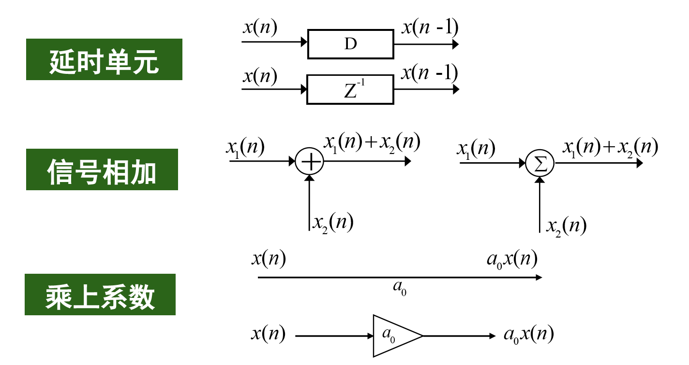
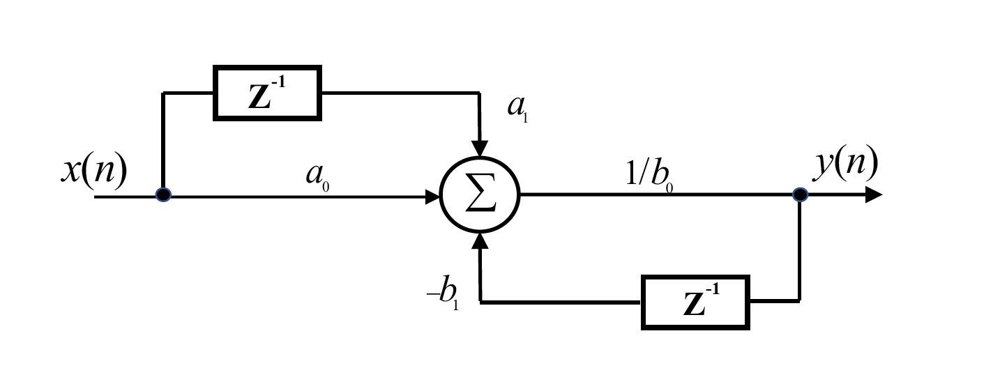
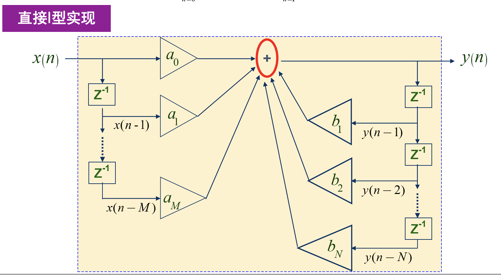
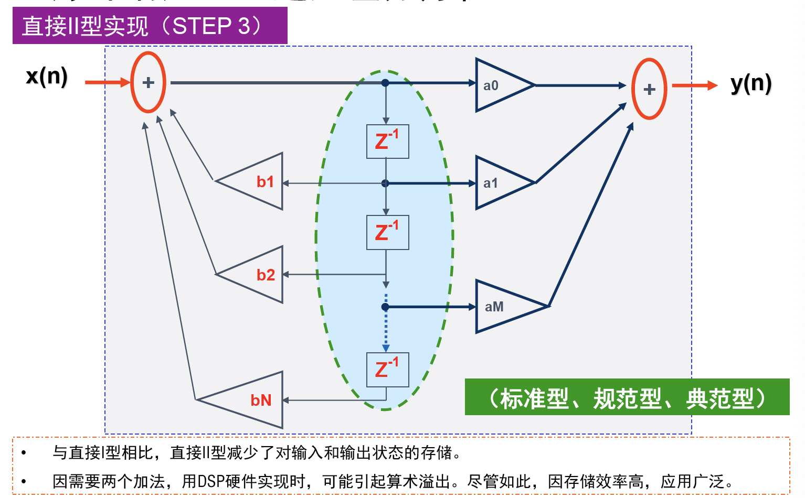
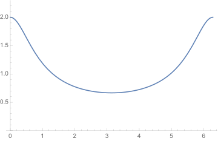

# Lecture 13

## 数字滤波器的描述

### 差分方程

例：

\[ y(n) = \frac{1}{b_0}[a_0x(n)+a_1x(n-1)-b_1y(n-1)] \]

更一般的：

\[ \sum_{k=0}^{N}b_ky(n-k)=\sum_{r=0}^{M}a_rx(n-r) \]

\(N\)为所需要的过去的输出的个数，通常称为滤波器的阶数。

差分方程流图：

如\( y(n) = \frac{1}{b_0}[a_0x(n)+a_1x(n-1)-b_1y(n-1)] \)的流图为：

### 系统响应

单位脉冲函数：

\[ \delta[n] = \begin{cases}
1, &n=0 \\
0, &n\neq 0
\end{cases} \]

系统的单位脉冲响应就是输入为单位冲激时的响应，即令\(x(n)=\delta(n)\)，那么\(y(n)=h(n)\)为响应函数。如：

\[ y(n) = \frac{1}{b_0}[a_0x(n)+a_1x(n-1)-b_1y(n-1)] \]

的系统响应方程为：

\[ h(n) = \frac{1}{b_0}[a_0\delta(n)+a_1\delta(n-1)-b_1h(n-1)] \]

如果差分方程中不含以前的输出信号，那么脉冲响应最后会消失，称为有限长冲激响应(FIR, Finite Impulse Response Filter)滤波器。否则冲激响应永远不会消失，称为无限长冲激响应(IIR, Infinite Impulse Response Filter)滤波器。

各类流图：

### 卷积描述

输入信号可以看做一系列脉冲之和：

\[ x(n) = \sum_{k=-\infty}^{\infty}x(k)\delta(n-k) \]

单位脉冲\(\delta(n)\)时的响应为\(h(n)\)，根据LTI系统的线性特性和时不变特性，输入\(x(n)\)时的输出为：

\[ y(n) = \sum_{k=-\infty}^{\infty}x(k)h(n-k) \]

而右式恰好为卷积\(x(n)\ast h(n)\)：

\[ x(n)\ast h(n) = \sum_{k=-\infty}^{\infty}x(k)h(n-k) \]

这说明了，系统的输出相当于输入信号与单位脉冲响应的卷积。

### 脉冲响应的用途

1. LTI系统是稳定的充要条件为单位脉冲响应绝对收敛：\(\sum_{k=-\infty}^{\infty}|h(k)|<\infty\)
2. 系统串联相当于脉冲响应函数做卷积，系统并联相当于脉冲响应函数相加

### 频率响应

定义滤波器的频率响应：

\[ H(\Omega) = \frac{Y(\Omega)}{X(\Omega)} = \mathbf{DTFT}[h(n)] \]

频率响应的模长和相位分别称为幅~频响应和相频响应。

对差分方程做DTFT后再化简可以得到：

\[ H(\Omega) = \frac{\sum_{k=0}^Ma(k)e^{-j\Omega k}}{\sum_{k=0}^Mb(k)e^{-j\Omega k}} \]

如对于差分方程：\(y(n)=ay(n-1)+x(n)\)，其系统频率响应为：

\[ H(\Omega) = \frac{e^{j\Omega}}{e^{j\Omega}-a}=\frac{1}{(1-a\cos\Omega)+ja\sin\Omega} \]

进一步的，其幅频响应为：

\[ |H(\Omega)| = \frac{1}{\sqrt{1+a^2-2a\cos\Omega}} \]

若\(0 < a < 1\)，那么这个系统为低通滤波器：

与脉冲响应对应的，系统串联相当于频率响应相乘，系统并联相当于频率响应相加。

## Z变换

只要有某些概念在某些时候不成立或无定义，那么数学家总会试图推广它们。上面提到，滤波器的稳定条件是其脉冲响应函数绝对收敛，而更一般的，离散信号傅立叶变换收敛的条件也很类似：\(\sum_{n=-\infty}^{\infty}|x(n)| < \infty\)。但是不满足这个条件的信号，是否也有类似的变换存在呢？

这样我们就引入了Z变换：通过向\(x(n)\)乘一个指数函数\(r^{-n}\)来让它们能够收敛：

\[ \sum_{n=-\infty}^{\infty}x(n)r^{-n}e^{-jn\Omega} = \sum_{n=-\infty}^{\infty}x(n)(re^{j\Omega})^{-n} = \sum_{n=-\infty}^{\infty}x(n)z^{-n} \]

这样我们就得到了Z变换的表达式：

\[ X(z) = \sum_{n=-\infty}^{\infty}x(n)z^{-n} \]

事实上，离散时间傅立叶变换是Z变换的特例，即\(z\)在单位圆上的函数值\(z=e^{j\Omega}\)。通过Z变换，我们将频率空间从单位圆扩展到了整个复数平面。

### Z变换的收敛域(ROC)

当然，即使乘上这样的指数函数，也不可能在任何地方都会收敛。我们定义满足以下可和条件的\(z\)的集合为收敛域，简写为ROC：

\[ \sum_{n=-\infty}^{\infty}|x(n)r^{-n}| < \infty \]

不同的序列可能有相同的Z变换表达式，但是其收敛域不同，在计算ZT和IZT的过程是一定要注意不同收敛域的影响。

Z变换的收敛域一般是平面上以原点为中心的圆环，而且通常以极点\(X(z)=\infty\)为圆环边界。

#### 特殊序列的收敛域

**有限长序列**

\[ X(z) = \sum_{n=n_1}^{n_2}x(n)z^{-n} \]

其ROC至少是\(0 < |z| < \infty\)序列的左右端点只会影响其在零点和无穷点的收敛情况：

\[ \begin{cases}
n_1<0,n2>0 &\Rightarrow 0 < |z| < \infty \\
n_1<0,n2\leqslant 0 &\Rightarrow 0 \leqslant |z| < \infty \\
n_1\geqslant 0,n2>0 &\Rightarrow 0 < |z| \leqslant \infty \\
\end{cases} \]

------

**右边序列**

\[ X(z) = \sum_{n=n_1}^{\infty}x(n)z^{-n} \]

由根值法判断收敛，得到：

\[ |z| > \frac{1}{\lim_{n\rightarrow\infty}\sqrt[n]{|x(n)|}}=R_{x1} \]

端点只影响无穷远处的情况：

\[ \begin{cases}
n_1\geqslant 0 &\Rightarrow R_{x1} < |z| \leqslant \infty\\
n_1<0 &\Rightarrow R_{x1} < |z| < \infty
\end{cases} \]

收敛域为半径为\(R_{x1}\)的圆外部分。

注意\(n_1\geqslant 0\)的情况下，\(x(n)\)实际上是**因果序列**。

------

**左边序列**

\[ X(z) = \sum_{n=-\infty}^{n_2}x(n)z^{-n} \]

由根值法判断收敛，得到：

\[ |z| < \frac{1}{\lim_{n\rightarrow\infty}\sqrt[n]{|x(-n)|}}=R_{x2} \]

端点只影响原点的情况：

\[ \begin{cases}
n_2>0 &\Rightarrow 0 < |z| < R_{x2}\\
n_2\leqslant 0 &\Rightarrow 0 \leqslant |z| < R_{x2}
\end{cases} \]

收敛域为半径为\(R_{x2}\)的圆内部分。

注意\(n_2\leqslant 0\)的情况下，\(x(n)\)实际上是**反因果序列**。

------

**双边序列**

\[ X(z) = \sum_{n=-\infty}^{\infty}x(n)z^{-n} \]

可以看做是左边序列和右边序列的组合，因此收敛域也为两种序列的交集。设：

\[ R_{x1} = \lim_{n\rightarrow\infty}\sqrt[n]{|x(n)|}, R_{x2} = 1/\lim_{n\rightarrow\infty}\sqrt[n]{|x(-n)|} \]

若极限存在且\(R_{x1} < R_{x2}\)，那么收敛域为：

\[ R_{x1} < |z| < R_{x2} \]

否则收敛域为空集。

### 常见序列的Z变换

\[ \begin{align}
\delta(n) &\leftrightarrow 1 & \\
u(n) &\leftrightarrow \frac{1}{1-z^{-1}} & |z| > 1 \\
G_N(N) &\leftrightarrow \frac{1-z^{-N}}{1-z^{-1}} & 0 < |z| \leqslant \infty \\
a^nu(n) &\leftrightarrow \frac{1}{1-az^{-1}} & |z| > |a| \\
-a^nu(-n-1) &\leftrightarrow \begin{cases} \frac{1}{1-az^{-1}} & |z| < |a| \\ 0 & z=0\end{cases} &
\end{align} \]

### Z变换的性质

1. 线性
2. 平移不变性：\(\mathbf{Z}[x(n+m)]=z^mX(z)\)
3. 时域扩展性：\(\mathbf{Z}[x_{(a)}(n)]=X(z^a),R_1 < |z^a| < R_2\)
4. 对称性：
      1. 若序列为偶对称的，则：\(X(z)=X(\frac{1}{z})\)
      2. 若序列为奇对称的，则：\(X(z)=-X(\frac{1}{z})\)
5. Z域尺度变换/序列指数加权
      1. \( \mathbf{Z}[a^nx(n)] = X(\frac{z}{a}) \)
      2. \( \mathbf{Z}[a^{-n}x(n)] = X(az) \)
      3. \( \mathbf{Z}[(-1)^nx(n)] = X(-z) \)
      4. \( \mathbf{Z}[e^{jn\omega_0}x(n)] = X(e^{-j\omega_0}z) \)
6. Z域微分/序列线性加权
      1. \( \mathbf{Z}[nx(n)] = -z\frac{d}{dz}\mathbf{Z}[x(n)] \)
7. 初值定理
      1. 若\(X(z)\)为因果序列\(x(n)\)的Z变换，则有\(x(0)=\lim_{z\rightarrow\infty}X(z)\)
8. 终值定理
      1. 若\(X(z)\)为因果序列\(x(n)\)的Z变换，则有\(\lim_{n\rightarrow\infty}x(n)=\lim_{z\rightarrow 1}(z-1)X(z)\)
9. 时域卷积定理：\( \mathbf{Z}[x(n)\ast y(n)] = \mathbf{Z}[x(n)]\cdot \mathbf{Z}[y(n)] \)

其中，时域扩展函数定义如下：

\[ x_{(a)}(n) = \begin{cases}
x(\frac{n}{a}), &\frac{n}{a}\in\mathbb{Z} \\
0, &\frac{n}{a}\notin\mathbb{Z}
\end{cases}\quad (0\neq a \in \mathbb{Z}) \]
