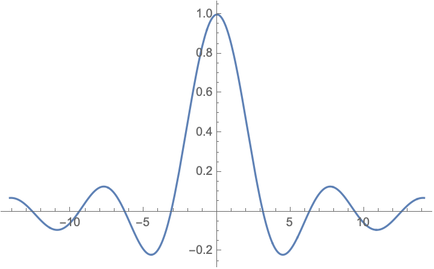

# Lecture 1

## 信号的表示

1. 数学表达式：一个或若干个自变量的函数或序列，如\(f(t)\)、\(x(n)=e^{-n}\)等
2. 波形图：
      1. 画出函数随自变量的变化关系，典型的如时域波形图
      2. 频谱图等也是常用的表示信号的图像

## 典型信号

### Sa函数

\[ Sa(t) = \frac{\sin t}{t} \]

特点：

1. 偶函数
2. \(Sa(k\pi) = 0, k\in\mathbb{Z}\)
3. \(\int_{-\infty}^{+\infty}Sa(t)dt = \pi\)
4. \(\int_{0}^{+\infty}Sa(t)dt = \int_{-\infty}^{0}Sa(t)dt  = \frac{\pi}{2}\)

??? note "积分性质的证明"
    这个积分被称为[Dirichlet integral](https://en.wikipedia.org/wiki/Dirichlet_integral)，已经有众多巧妙的计算方法，请参考[stackexchange](https://math.stackexchange.com/questions/5248/evaluating-the-integral-int-0-infty-frac-sin-x-x-mathrm-dx-frac-pi)。这里选取最容易理解的二元积分方法。

    注意到：

    \[\int_0^{+\infty} e^{-xy}\sin x dy = \frac{\sin x}{x}\]

    因此我们有：

    \[ \int_{0}^{+\infty}Sa(x)dx = \int_{0}^{+\infty} \left(\int_0^{+\infty} e^{-xy}\sin x dy\right)dx \]

    交换积分顺序：

    \[
        \int_{0}^{+\infty} \left(\int_0^{+\infty} e^{-xy}\sin x dy\right)dx
        =\int_{0}^{+\infty} \left(\int_0^{+\infty} e^{-xy}\sin x dx\right)dy
    \]

    由分部积分法：

    \begin{align}
        \int e^{-xy}\sin x dx &= -e^{-xy}\cos x - y\int e^{-xy}\cos x dx \\
        &= -e^{-xy}\cos x - y\left(e^{-xy}\sin x+y\int e^{-xy}\sin xdx \right)
    \end{align}

    解得：
    
    \[ \int e^{-xy}\sin x dx = \frac{-ye^{-xy}\sin x - e^{-xy}\cos x}{1+y^2} \]
    
    因此：

    \[ \int_0^{+\infty} e^{-xy}\sin x dx = \frac{1}{1+y^2} \]

    最后：

    \[ \int_{0}^{+\infty}Sa(x)dx = \int_0^{+\infty}\frac{1}{1+y^2}dy = \arctan y |_0^{+\infty} = \frac{\pi}{2} \]

### 指数信号

\[ f(t) = Ke^{\alpha t} \]

## 信号的分类

1. 按分布性质
      - 确定性信号
      - 随机性信号
2. 连续性
      - 连续时间信号(Continuous-Time Signal)
      - 离散时间信号(Discrete-Time Signal)
3. 因果性
      - 因果信号：\(t<0\Rightarrow x(t)=0\)
      - 非因果信号
      - 反因果信号：\(t>0\Rightarrow x(t)=0\)
4. 周期性
5. 实值信号与复值信号

## 信号的基本运算

1. 普通四则运算
2. 波形变化
      1. 时移运算：\(f(t-a)\)
      2. 压扩运算：\(f(kt)\)
      3. 反褶运算：\(f(-t)\)
3. 积分与微分
4. 能量与功率
      1. 瞬时功率：\(||f(t)||^2\)
      2. 能量：
         1. 连续：\(E[f(t)]=\int_{-\infty}^{+\infty} ||f(t)||^2 dt\)
         2. 离散：\(E[x(n)]=\sum_{n=-\infty}^{+\infty} ||x(n)||^2\)
      3. 平均功率：
         1. 连续：\(P[f(t)]=\lim_{T\to \infty}\frac{1}{T}\int_{-T/2}^{+T/2} ||f(t)||^2 dt\)
         2. 离散：\(P[x(n)]=\lim_{N\to \infty}\frac{1}{2N+1}\sum_{n=-N}^{N} ||x(n)||^2\)
      4. 据此也可分类信号
         1. 能量信号：均收敛
         2. 功率信号：无穷能量+有限功率
         3. 非能非功信号：均不收敛
5. 卷积（在下一讲）

## 欧拉公式与复指数信号

### 欧拉公式

\[ e^{ix}=\cos x + i\cdot\sin x \]

??? note "欧拉公式的证明"
    这个著名的公式也有相当多的证明方法。课件上列举了两种，而且课后作业正是让我们找到第三种方法。参考[维基百科](https://en.wikipedia.org/wiki/Euler%27s_formula)来获得更多信息，这里列举上面的第一种方法。

    考虑函数

    \[ f(\theta) = \frac{\cos\theta + i\sin\theta}{e^{i\theta}} = e^{-i\theta}(\cos\theta + i\sin\theta) \]

    若要证明欧拉公式，只需要证明函数\(f(\theta)\)恒为1。

    将其微分，可得：

    \[ f'(\theta) = e^{-i\theta}(i\cos\theta - \sin\theta) - ie^{-i\theta}(\cos\theta + i\sin\theta) = 0 \]

    而又恰好\( f(0) = 1 \)。因此

    \[ f(\theta) = \frac{\cos\theta + i\sin\theta}{e^{i\theta}} \equiv 1 \]

    \[ e^{ix}=\cos x + i\cdot\sin x \]

### 复指数信号

\[ f(t) = Ke^{st} \]

其中\(s\)为复数，可以写为\(s=\sigma+i\omega, \sigma,\omega\in\mathbb{R}\)。根据欧拉公式，我们有：

\[ f(t) = Ke^{\sigma t}\cdot(\cos\omega t+i\sin\omega t) \]
