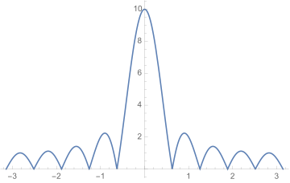
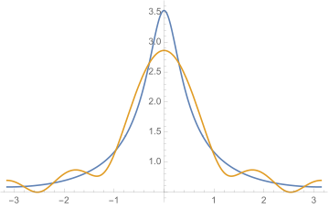
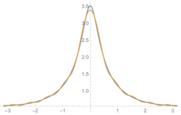
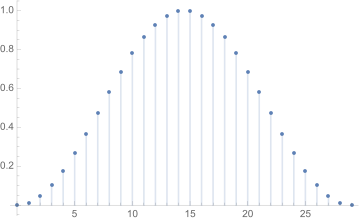
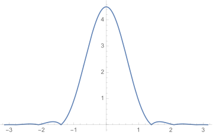
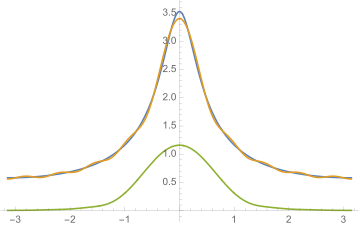

# Lecture 6

## 离散时间序列

单位采样序列

\[ \delta(n) = \begin{cases} 1,&n=0 \\ 0,&n\neq 0 \end{cases} \]

单位阶跃序列

\[ u(n) = \begin{cases} 1,&n\geqslant 0 \\ 0,&n< 0 \end{cases} \]

矩形序列

\[ R_N(n) = \begin{cases} 1,&0\leqslant n \leqslant N-1 \\ 0,&\text{otherwise} \end{cases}  \]

三种序列之间的关系：

\[ \begin{gather}
\delta(n) = u(n) - u(n-1) \\
u(n) = \sum_{k=0}^{\infty}\delta(n-k) \\
R_N(n) = u(n) - u(n-N) = \sum_{k=0}^{N-1}\delta(n-k)
\end{gather} \]

实指数序列

\[ x(n) = a^n\cdot u(n) \]

## 离散时间傅立叶变换

经过推导，可以使用离散的采样值序列计算理想采样信号的频谱密度：

\[ X_p(\omega) = \sum_{n=-\infty}^{\infty} x(nT_s)e^{-j\omega nT_s} \]

其逆变换为：

\[ x(nT_s) = \frac{1}{\omega_s}\int_{-\omega_s/2}^{\omega_s/2} X_p(\omega)e^{jn\omega T_s}d\omega \]

### 频率归一化

将频率和时间归一化处理。我们令原来的一个采样周期\(T_s\)为单位1的逻辑时间或数字时间，因此原来模拟时间的采样值序列\(x(nT_s)\)变为数字时间上的序列\(x(n)\)。

数字频率\(\Omega\)与模拟频率\(\omega\)之间的关系则为：\( \Omega = \omega T_s = 2\pi\frac{\omega}{\omega_s} \)

采用归一化后的离散时间傅立叶变换则为：

\[ \begin{gather}
X(\Omega) = \mathbf{DTFT}[x(n)] = \sum_{n=-\infty}^{\infty}x(n)e^{-j\Omega n} \\
x(n) = \mathbf{IDTFT}[X(\Omega)] = \frac{1}{2\pi}\int_{-\pi}^{\pi}X(\Omega)e^{j\Omega n}d\Omega
\end{gather} \]

这样的优点是在处理时可以无需关心真正的采样间隔，因为频谱周期始终是\(2\pi\)，而且对于计算机来说，可以使其只关心数值表示在保证正确性的前提下提高算法的适用性。

### 常用信号的DTFT

\[ \begin{align}
\delta(n) &\overset{\mathbf{DTFT}}{\longleftrightarrow} 1\\
a^nu(n) &\overset{\mathbf{DTFT}}{\longleftrightarrow} \frac{1}{1-ae^{-j\Omega}}, |a| < 1\\
R_N(n) &\overset{\mathbf{DTFT}}{\longleftrightarrow} \frac{\sin(N\Omega/2)}{\sin(\Omega/2)}e^{-j\frac{N-1}{2}\Omega} \\
Sa(\Omega_cn) &\overset{\mathbf{DTFT}}{\longleftrightarrow} \frac{\pi}{\Omega_c}\sum_{l=-\infty}^{\infty}G_{2\Omega_c}(\Omega-2\pi l) \\
\end{align} \]

### DTFT的性质

1. 线性
2. 周期性：\(X(\Omega)=X(\Omega+2\pi)\)
3. 平移性质
      1. 时域平移：\(\mathbf{DTFT}[x(n-n_0)]=e^{-j\Omega n_0}X(\Omega)\)
      2. 频域平移：\(\mathbf{DTFT}[e^{j\Omega_0 n}x(n)]=X(\Omega-\Omega_0)\)
4. 反褶：\( \mathbf{DTFT}[x(-n)] = X(-\Omega) \)
5. 共轭：\( \mathbf{DTFT}[x^*(n)] = X^*(-\Omega) \)
6. 时域拓展：\( \mathbf{DTFT}[x_{(a)}(n)] = X(a\Omega) \)
7. 时域差分：\( \mathbf{DTFT}[x(n)-x(n-1)] = (1-e^{-j\Omega})X(\Omega) \)
8. 频域微分：\( \mathbf{DTFT}[nx(n)] = j[\frac{d}{d\Omega}X(\Omega)] \)
9. 卷积性质
      1. 时域卷积：\( \mathbf{DTFT}[x_1(n)\ast x_2(n)] = X_1(\Omega)\cdot X_2(\Omega) \)
      2. 频域卷积：\( \mathbf{DTFT}[x_1(n)\cdot x_2(n)] = \frac{1}{2\pi} X_1(\Omega)\otimes X_2(\Omega) \)
      3. 其中\(\otimes\)代表圆周卷积，意为将卷积限制在周期函数的一个周期内：\( X_1(\Omega)\otimes X_2(\Omega) = \int_{-\pi}^{\pi}X_1(\Omega')X_2(\Omega-\Omega')d\Omega' \)
10. 帕斯瓦尔定理：\( \sum_{n=-\infty}^{\infty}|x(n)|^2 = \frac{1}{2\pi}\int_{-\pi}^{\pi}|X(\Omega)|^2d\Omega \)

## 有限长序列的DTFT

### 时域加矩形窗信号的DTFT

计算机无法处理无限长的时域信号，因此只能通过窗函数截取一段信号序列进行处理。最简单的窗函数就是矩形窗：

\[ W_L(n) = \begin{cases} 1,& 0\leqslant n \leqslant L-1 \\ 0,& \text{otherwise} \end{cases} \]

加窗后的信号变为：

\[ x_L(n) = x(n)W_L(n) = \begin{cases} x(n),& 0\leqslant n \leqslant L-1 \\ 0,& \text{otherwise} \end{cases} \]

根据卷积定理，加窗后的频谱为：

\[ X_L(\Omega) = \frac{1}{2\pi}X(\Omega)\otimes W(\Omega) = \frac{1}{2\pi}\int_{-\pi}^{\pi}X(\Omega')W(\Omega-\Omega')d\Omega' \]

其中矩形窗的频谱容易计算：

\[ W(\Omega) = \frac{\sin(L\Omega/2)}{\sin(\Omega/2)}e^{-j\frac{L-1}{2}\Omega} \]

其幅度频谱图形为(\(L=10\))：

其中：

- 最高点为\(W(0) = L\)
- 主瓣：
      - 第一个过零区间\((-\frac{2\pi}{L}, \frac{2\pi}{L})\)
      - 主瓣宽度：\(\Delta\Omega_W = \frac{2\pi}{L}\)
- 旁瓣：其他部分

### 加窗对序列频谱的影响

- \(L\)越大，主瓣宽度越小，频谱分辨率越高，分辨能力越强。
      - 定义**频谱分辨率**为可以分辨的相距最近的谐波分量频率\(\Delta\Omega\geqslant\Delta\Omega_W=\frac{2\pi}{L}\)
    - **不确定原理**：加窗后可分辨的最小频率间隔由数据长度决定。
- 产生**频谱泄漏**现象，即频谱在真实频率周围存在大量杂散频率，且最大值也有一定下降。

下图演示了离散信号\(x(n)=e^{-\frac{1}{3}n}u(n)\)加窗与否的DTFT频谱图，其中的窗函数为长度为5的矩形窗：

可以看到，橙色的曲线描述的是加窗后的频谱，与原来的蓝色曲线频谱相比，最大值有所减少，而且也确实混入了一些局部极值，即泄漏的杂散频率。

如果要提高加窗后的频谱准确率，那么可以增大采样窗，减少主瓣宽度，也即提高频谱分辨率。如下面就是增大窗到长度为10时的频谱对比图：

我们也可以减小旁瓣，令要泄漏出去的频率快速衰减。这时我们就需要更换更加复杂的窗函数，常用的有汉宁窗和平顶窗。如汉宁窗的窗函数：

\[ w(n)=\frac{1}{2}(1-\cos\frac{2\pi n}{N-1}), 0\leqslant n \leqslant N-1\]

\(N=30\)时的图形为：

\(N=10\)频谱图为：

可以看到，与矩形窗相比，汉宁窗的旁瓣很小，有利于减小泄漏，但是主瓣则相对较大，频谱分辨率较低。

用\(N=10\)的汉宁窗处理上面所述的指数信号，与同样长度的矩形窗进行对比：

